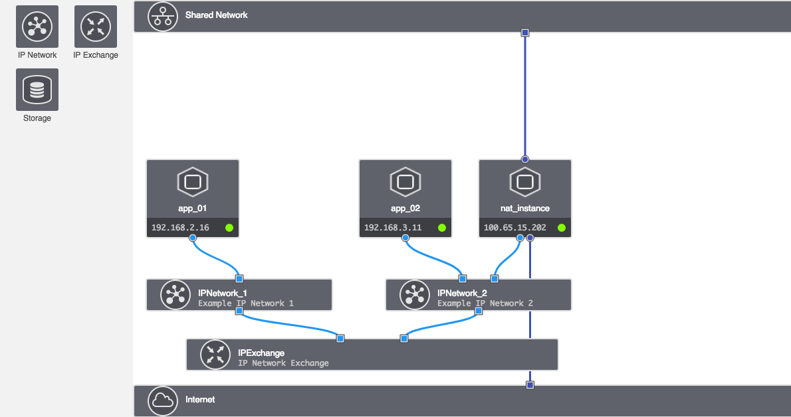
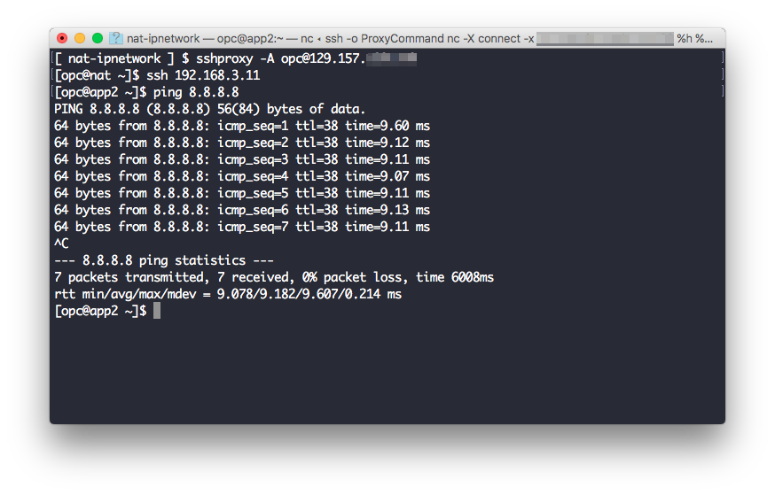

## NAT网络作用

在公有云网络安全设置的最佳实践过程中，NAT网络都会起到举足轻重的作用。

>NAT中文全称为“网络地址转换”，也叫做网络掩蔽或者IP掩蔽（IP masquerading），是一种IP数据包通过路由器或防火墙时重写来源IP地址或目的IP地址的技术。这种技术被普遍使用在有多台主机但只通过一个公有IP地址访问互联网的私有网络中。

我们通常在公有云中会至少划分两个区域来确保整个云资源的安全，一个区域是能够访问互联网同时也能被互联网访问，一般被称为公有子网，通常这个子网中虚拟机实例是有公网IP，而另外一个区域是不能直接访问互联网或者被互联网访问的，一般称为私有子网，这个子网中的虚拟机是没有公网IP的。公有云网络最佳实践的要求是将所有运行客户自有应用的虚拟机应该都规划到私有子网中，而只需要将负载均衡、运维跳板机和NAT网关放在公有子网中，并拥有相应的公网的IP地址。

我们看一个典型的按照最佳实践部署网络拓扑图



其中为了简化我们只使用了一个有公网IP的实例充当了NAT实例和堡垒机（跳板机）双重作用，通过Oracle Compute的Shared Network申请的公网IP连接互联网。而在IPNetwork\_1和IPNetwork\_2两个网络中app\_01和app\_02两个虚拟机实例通过nat\_instance这个实例将访问互联网的流量转发出去，而自己没有公网IP且通过互联网也访问不到这两个实例。这样IPNetwork\_1和IPNetwork\_2就是我们在前面提到公有云网络安全最佳实践中提到的私有子网的作用，用户所有自己的应用及数据库都应该在这些子网中，而Shared IPNetwork的作用就是公有子网，如果需要设置负载均衡和单独的堡垒机也要放在这个子网中。

## NAT网络在Oracle Compute中的技术实现

NAT网络技术架构在Oracle Compute中实现主要依靠以下技术实现：

* IP Network Exchange：实现不同IP Network之间的通讯需求，既实现了互联互通，又实现了一定程度的隔离，例如我们上面的例子中可以将APP和DB两种不同工作负载分别放在IP Network\_1和IPNetwork\_2中。
* vNICSet：这个对象是Oracle Compute中虚拟网卡的集合，通过定义好这个集合我们可以在Routing中引用这个集合直接在网络虚拟化层将数据流量发给这个集合，在我们上面的例子中就是将nat_instance上的网卡自己定义成一个vNICSet集合，而直接将所有互联网的流量发往这个vNICSet。
* Routing：上面我们提到了，通过在Routing中直接将目的地指定IP范围内的网络流量全部发往一个预先定义好的vNICSet。
* Linux IP Tables：通过在Linux操作系统中自带的防火墙功能实现指定来源的MASQUERADE网络转发，在Linux操作系统内部实现NAT功能。

以上几项技术前三项都是通过Oracle Compute云网络虚拟化的SDN功能实现，通过Compute云的控制台或者其他API的方式进行设置，而最后一项需要在NAT实例的操作系统中拥有ROOT权限的帐户运行操作系统命令实现。

## 实现的具体步骤

作为公有云最大的好处可以通过各种API或者DevOps工具的支持实现基础架构即代码的功能，Oracle Compute也有很多这方面的支持，在本文中将使用Terraform来实现快速的Oracle Compute部署，需要了解详细的Terraform对Oracle Compute的支持请参看[这篇文章](/oracle/cloud/2017/07/05/opc-terraform.html)。本文使用的Terrform模版请使用以下[链接](https://github.com/zorrofox/nat-ipnetwork)下载。

Terraform的Oracle Compute模版文件一共有两个，分别是*main.tf*和*variables.tf*两个文件，*main.tf*是主要的模版文件，Compute资源都是在这个文件中定义的，*variables.tf*是存放Compute帐号、密码、域、Endpoint等与连接相关的信息，这些信息需要根据你自己的帐号信息进行修改才能使用。下面我们将这两个文件全部粘贴出来详细分析一下。

*main.tf*

```
provider "opc" {
  user = "${var.user}"
  password = "${var.password}"
  identity_domain = "${var.domain}"
  endpoint = "${var.endpoint}"
}

resource "opc_compute_ssh_key" "ssh_key" {
  name = "ip-network-example-key"
  key = "${file(var.ssh_public_key)}"
  enabled = true
}

resource "opc_compute_ip_network" "ip-network-1" {
  name = "IPNetwork_1"
  description = "Example IP Network 1"
  ip_address_prefix = "192.168.2.0/24"
  ip_network_exchange = "${opc_compute_ip_network_exchange.test-ip-network-exchange.name}"
}

resource "opc_compute_ip_network" "ip-network-2" {
  name = "IPNetwork_2"
  description = "Example IP Network 2"
  ip_address_prefix = "192.168.3.0/24"
  ip_network_exchange = "${opc_compute_ip_network_exchange.test-ip-network-exchange.name}"
}

resource "opc_compute_ip_network_exchange" "test-ip-network-exchange" {
  name = "IPExchange"
  description = "IP Network Exchange"
}

resource "opc_compute_vnic_set" "nat_set" {
  name         = "nat_vnic_set"
  description  = "NAT vnic set"
}

resource "opc_compute_route" "nat_route" {
  name              = "nat_route"
  description       = "NAT IP Network route"
  admin_distance    = 1
  ip_address_prefix = "0.0.0.0/0"
  next_hop_vnic_set = "${opc_compute_vnic_set.nat_set.name}"
}

resource "opc_compute_instance" "instance-1" {
	name = "app_01"
  hostname = "app01"
	label = "app_01"
	shape = "oc3"
	image_list = "/oracle/public/OL_7.2_UEKR4_x86_64"
  networking_info {
    index = 0
    ip_network = "${opc_compute_ip_network.ip-network-1.name}"
    ip_address = "192.168.2.16"
  }
  ssh_keys = [ "${opc_compute_ssh_key.ssh_key.name}" ]
}

resource "opc_compute_instance" "instance-2" {
	name = "app_02"
  hostname = "app2"
	label = "app_02"
	shape = "oc3"
	image_list = "/oracle/public/OL_7.2_UEKR4_x86_64"
  networking_info {
    index = 0
    ip_network = "${opc_compute_ip_network.ip-network-2.name}"
    ip_address = "192.168.3.11"
  }
  ssh_keys = [ "${opc_compute_ssh_key.ssh_key.name}" ]
}

resource "opc_compute_instance" "instance-3" {
	name = "nat_instance"
  hostname = "nat"
	label = "nat_instance"
	shape = "oc3"
	image_list = "/oracle/public/OL_7.2_UEKR4_x86_64"
  networking_info {
    index = 0
    shared_network = true
    nat = [ "${opc_compute_ip_reservation.reservation1.name}" ]
  }
  networking_info {
    index = 1
    ip_network = "${opc_compute_ip_network.ip-network-2.name}"
    ip_address = "192.168.3.16"
    vnic_sets = ["${opc_compute_vnic_set.nat_set.name}"]
  }
  ssh_keys = [ "${opc_compute_ssh_key.ssh_key.name}" ]

  instance_attributes = <<JSON
  {
    "userdata":{
      "pre-bootstrap": {
        "failonerror": true,
        "script": [
          "sysctl -w net.ipv4.ip_forward=1",
          "systemctl start iptables",
          "iptables -t nat -A POSTROUTING -o eth0 -s 192.168.3.0/24 -j MASQUERADE",
          "iptables -t nat -A POSTROUTING -o eth0 -s 192.168.2.0/24 -j MASQUERADE",
          "iptables -D FORWARD 1"
        ]
      }
    }
  }
  JSON
}

resource "opc_compute_ip_reservation" "reservation1" {
	parent_pool = "/oracle/public/ippool"
	permanent = true
}


output "public_ip" {
  value = "${opc_compute_ip_reservation.reservation1.ip}"
}
```

这个模版就将我们需要的所有Compute资源，以及其相关联的信息全部定义好了，可以直接部署，不用进行任何修改。其中重点说明的是我们把需要在NAT实例中运行的操作系统的命令也放在这个模版文件中，通过Compute实例的User Data功能自动执行，无需再通过手工运行，实现了自动化处理。

*variables.ft*

```
variable user {
  default = "<Your OPC Account>"
}
variable password {
  default = "<Your OPC Password>"
}
variable domain {
  default = "<Your OPC Domain>"
}
variable endpoint {
  default = "<OPC Endpoint for Your IDC>"
}

variable ssh_user {
  description = "User account for ssh access to the image"
  default     = "opc"
}

variable ssh_public_key {
  description = "File location of the ssh public key"
  default     = "<Path of the Public Key File in Your Computer>"
}
```

这个需要根据自己帐户的情况进行修改才能运行整个Terraform模版。修改完*variables.tf*这个模版后，在模版存放的目录下运行：

```bash
$ terraform plan
```

来检查两个模版文件是否正确，如果模版有任何问题，在输出中会打印出来，如果确认输出正常，我们可以紧接着运行：

```bash
$ terraform apply
```

这个命令会运行一段时间来在Compute云中部署所有的资源，如果一切正常，Terraform最后会将我们的NAT实例的公网IP打印出来。紧接着我们通过SSH客户端使用我们对应私钥登录NAT实例，并将NAT实例作为跳板机登录放在私网中的192.168.2.16或者192.168.3.11这两个实例，PING一个公网地址比如8.8.8.8来测试我们整个设置：



## 总结

Oracle Compute云的IP Network作为SDN的核心功能，可以灵活的为我们在Compute云中搭建自己定义的企业级网络并兼顾各种网络安全的最佳实践。