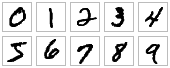

TensorFlow官方最新的教程[原文](https://www.tensorflow.org/tutorials/layers)翻译。

TensorFlow layer模块通过提供高层级的API来方便的构建一个神经网络，方便的创建密集（全关联）层和卷积层，添加激活函数和应用dropout正则化。在本教程中将学习如何使用layer来构建一个卷积神经网络模块识别MINIST数据集中手写的数字。



**[MNINST数据集](http://yann.lecun.com/exdb/mnist/)有60,000个训练样本图片和10,000个测试样本图片，其中图片是由28x28像素的黑白手写的数字0到9组成。**

## 开始
我们先设置一个TensorFlow程序的骨架。创建一个名为``cnn_mninst.py``的文件，以下是代码内容：

```python
from __future__ import absolute_import
from __future__ import division
from __future__ import print_function

# Imports
import numpy as np
import tensorflow as tf

tf.logging.set_verbosity(tf.logging.INFO)

# Our application logic will be added here

if __name__ == "__main__":
  tf.app.run()
```

在学习本教程过程中，将在以上内容中增加构建、训练和评价卷积神经网络的代码。完整、最终代码可以在[这里](https://www.github.com/tensorflow/tensorflow/blob/r1.7/tensorflow/examples/tutorials/layers/cnn_mnist.py)找到。

## 卷积神经网络介绍
卷积神经网络（CNN）是当前用于图像分类任务的最先进的模型体系结构。CNN在一个图片原始像素数据上应用一系列的过滤器（filter）提取和学习高层级的特征，用这些特征对图片进行分类。CNN包含三个部分：

* **卷积层，**对图片应用指定数量的卷积过滤器。对于每个分区卷积层执行一系列数学计算在输出特征映射（output feature map）中产生单一的值。卷积层随后一般会使用[ReLU激活函数](https://en.wikipedia.org/wiki/Rectifier_(neural_networks))产生非线性特性输出到模型中。
* **池化层（Pooling），**是对卷积层提取的图像数据进行降采样处理来降低特征映射的维度从而缩短处理时间。通常使用的池化算法是最大池化法（max pooling），提取特征映射分区（比如2x2像素范围）并保留它们的最大值而忽略掉其他的值。
* **密集（完全连接）层，**对卷积层和池化降采样层提取的特征进行分类。在密集层的每一个神经元节点都要与上一层的节点进行连接。

通常CNN是由一系列的执行特征提取卷积模块堆栈组成。每个模块由一个卷积层跟着一个池化层组成。最后一个卷积模块后面跟随着一个或者更多的密集层来执行分类。一个CNN中最后的密集层的神经元节点与模型中每一个需要分类的目标类别一一对应（模型预测到的所有可能分类），softmax激活函数会为每个神经元节点产生一个0到1之间的值（所有softmax值相加等于1）。我们可以将给定图像的softmax值解释为图像落入每个目标类别的可能性的相对测量值。

>提示：更为深入的CNN架构介绍参考斯坦福大学的[图像识别中应用卷积神经网络课程](https://cs231n.github.io/convolutional-networks/)。

## 构建CNN MNIST分类器
我们用以下CNN架构来创建一个MNIST数据集的图片分类的模型：

1. **卷积层#1：**应用32 5x5过滤器（提取5x5像素分区），使用ReLU激活函数
2. **池化层#1：**使用2x2过滤器执行最大池化并且设定步伐（stride）为2（这个值限定了池化区域不会重叠）
3. **卷积层#2：**应用64 5x5过滤器，使用ReLU激活函数
4. **池化层#2：**还是执行2x2过滤器最大池化，步伐值为2
5. **密集层#1：**1,024个神经元，使用dropout正则率为0.4（在训练过程中对所有元素有0.4的可能性会被丢弃）
6. **密集层#2（逻辑回归层）：**10个神经元，每个对应一个目标类别的数字（0 - 9）。

``tf.layers``模块包含以上三种类型层的创建方法：

* ``conv2d()``，构建一个二维卷机层。使用过滤器的量、过滤器核的维度、是否展开和激活函数作为参数。
* ``max_pooling2d()``，构建一个二维池化层，使用最大池化算法。使用池化过滤器和步伐值作为参数。
* ``dense()``，构建一个密集层。使用神经元数量和激活函数作为参数。

这三个方法都将一个张量作为输入并返回一个转换后的张量最为输出。将每个层连接起来非常容易：将一个层的输出作为输入即可。

打开``cnn_mnist.py``并增加以下``cnn_model_fn``函数，这个函数遵循了TensorFlow的Estimator API接口规范（详见[创建Estimator](https://www.tensorflow.org/tutorials/layers#create_the_estimator)）。``cnn_mnist.py``使用MNIST特征数据、标签和[模型模式](https://www.tensorflow.org/api_docs/python/tf/estimator/ModeKeys)（TRAIN、EVAL和PREDICT）作为参数；配置CNN；并返回预测、损失和一个训练操作：

```python
def cnn_model_fn(features, labels, mode):
  """Model function for CNN."""
  # Input Layer
  input_layer = tf.reshape(features["x"], [-1, 28, 28, 1])

  # Convolutional Layer #1
  conv1 = tf.layers.conv2d(
      inputs=input_layer,
      filters=32,
      kernel_size=[5, 5],
      padding="same",
      activation=tf.nn.relu)

  # Pooling Layer #1
  pool1 = tf.layers.max_pooling2d(inputs=conv1, pool_size=[2, 2], strides=2)

  # Convolutional Layer #2 and Pooling Layer #2
  conv2 = tf.layers.conv2d(
      inputs=pool1,
      filters=64,
      kernel_size=[5, 5],
      padding="same",
      activation=tf.nn.relu)
  pool2 = tf.layers.max_pooling2d(inputs=conv2, pool_size=[2, 2], strides=2)

  # Dense Layer
  pool2_flat = tf.reshape(pool2, [-1, 7 * 7 * 64])
  dense = tf.layers.dense(inputs=pool2_flat, units=1024, activation=tf.nn.relu)
  dropout = tf.layers.dropout(
      inputs=dense, rate=0.4, training=mode == tf.estimator.ModeKeys.TRAIN)

  # Logits Layer
  logits = tf.layers.dense(inputs=dropout, units=10)

  predictions = {
      # Generate predictions (for PREDICT and EVAL mode)
      "classes": tf.argmax(input=logits, axis=1),
      # Add `softmax_tensor` to the graph. It is used for PREDICT and by the
      # `logging_hook`.
      "probabilities": tf.nn.softmax(logits, name="softmax_tensor")
  }

  if mode == tf.estimator.ModeKeys.PREDICT:
    return tf.estimator.EstimatorSpec(mode=mode, predictions=predictions)

  # Calculate Loss (for both TRAIN and EVAL modes)
  loss = tf.losses.sparse_softmax_cross_entropy(labels=labels, logits=logits)

  # Configure the Training Op (for TRAIN mode)
  if mode == tf.estimator.ModeKeys.TRAIN:
    optimizer = tf.train.GradientDescentOptimizer(learning_rate=0.001)
    train_op = optimizer.minimize(
        loss=loss,
        global_step=tf.train.get_global_step())
    return tf.estimator.EstimatorSpec(mode=mode, loss=loss, train_op=train_op)

  # Add evaluation metrics (for EVAL mode)
  eval_metric_ops = {
      "accuracy": tf.metrics.accuracy(
          labels=labels, predictions=predictions["classes"])}
  return tf.estimator.EstimatorSpec(
      mode=mode, loss=loss, eval_metric_ops=eval_metric_ops)
```

以下几部分（对应以上每个代码块）更为深入的分析一下``tf.layers``在每个层中的代码如何使用，以及如何计算损失、配置训练操作和产生预测。如果你非常熟悉CNN和[TensorFlow Estimator](https://www.tensorflow.org/get_started/custom_estimators)，并觉得以上代码很熟，可以跳过直接到“训练和评价CNN MNIST分类器”部分。

### 输入层

在``layers``模块中创建卷积和池化层的方法需要二维的图片数据，并且要求输入张量具有``[batch_size，image_width，image_height，channels]``的形状，定义如下：

* ``batch_size``，在执行梯度递减训练时使用的样本子集的数量。
* ``image_width``,样本图片的宽度。
* ``image_height``，样本图片的高度。
* ``channels``，样本图片的颜色频道数量。对于彩色图片频道数量应该为3（红色、绿色和蓝色）。对于黑白图片只有1个频道（黑色）。

这里我们MNIST数据集是由28x28像素黑白图片组成的，所以输入层的形状应该为``[batch_size, 28, 28, 1]``。

将输入的特征映射（``features``）转换成这种形状，我们可以执行以下``reshape``操作：

```python
input_layer = tf.reshape(features["x"], [-1, 28, 28, 1])
```

注意这里我们指定了一个-1作为批数量，意味着这个维度将根据输入的``features["x"]``的数量来进行计算，而其他的维度使用指定的常量。这样我们就可以将``batch_size``作为超參来进行调优了。举个例子，如果我们给模型输入样本批数量为5，``features["x"]``将含有3,920个值（每个值代表了每张图片的每个像素），而``input_layer``将会是一个形状为``[5, 28, 28, 1]``的张量。

### 卷积层#1

在我们第一个卷积层，需要对输入层应用32 5x5过滤器，并使用ReLU激活函数。我们可以使用在``layers``模块中的``conv2d()``方法创建这个层：

```python
conv1 = tf.layers.conv2d(
    inputs=input_layer,
    filters=32,
    kernel_size=[5, 5],
    padding="same",
    activation=tf.nn.relu)
```

``inputs``参数指定了输入的张量形状必须为``[batch_size, image_width, image_height, channels]``。这里我们将第一个卷积层与``input_layer``连接起来，它的形状为``[batch_size, 28, 28, 1]``。

>注意：如果conv2d()使用参数**_data\_format=channels\_first_**，将会采用``[channels, batch_size, image_size, image_height]``的形状作为张量输入。

``filters``参数指定过滤器的数量（这里是32）和``kernel_size``指定过滤器的维度为``[width, height]``（这里是[5, 5]）。

**提示：**如果过滤器的宽和高相等，你可以将``kernel_size``指定一个整数即可——比如：``kernel_size=5``。

``padding``参数指定两个列举值中的一个（大小写敏感）：``valid``（默认值)或者``same``。用来指定输出张量是否与输入张量具有相同的高度和宽度值，这里我们设定``padding=same``。指示TensorFlow在输入张量的边缘填入0值来保持高和宽的值为28.(如果不使用扩展，一个5x5过滤器应用到28x28张量的卷积会产生24x24张量，因为会有5x5的范围被提取出来，那么只剩下24x24个地址)

``activation``参数指定卷积输出应用的激活函数。这里我们指定为ReLU激活函数``tf.nn.relu``。

我们的``conv2d()``输出的张量产生的形状为``[batch_size, 28, 28, 32]``：与输入相同的宽和高的维度，但是从每个过滤器中产生了32个频道值。

### 池化层#1

接着我们将刚刚产生的卷积层与第一个池化层进行连接。可以使用``layers``中的``max_pooling2d()``方法构建一个层来执行2x2过滤器和步幅为2的最大池化：

```python
pool1 = tf.layers.max_pooling2d(inputs=conv1, pool_size=[2, 2], strides=2)
```

同样``inputs``指定输入张量，形状为``[batch_size, image_width, image_height, channels]``。这里输入张量为conv1，第一个卷积层的输出，其形状为``[batch_size, 28, 28, 32]``。

>注意：当传入参数**data_format=channels\_first**时，**conv2d()**和**max_pooling2d()**也可以接受形状***[channels, batch_size, image_width, image_height]***。

``pool_size``参数指定最大池化过滤器的大小为``[width, height]``（这里为``[2, 2]``）。如果两个维度值相同，也可以指定一个整数（比如``pool_size=2``）。

``strides``参数指定步幅的大小。这里我们指定步幅为2，就是指定过滤器分区抽取时在高和宽两个维度中分别隔2个像素（对于2x2过滤器意味着没有区域会重叠）。如果你想对高和宽分别指定步幅值，可以使用一个tuple或列表（比如``stride=[3, 6]``）

我们``max_pooling2d()``输出张量（``pool1``）的形状为``[batch_size, 14, 14, 32]``：2x2过滤器将高和宽分别降低了50%。

### 卷积层#2和池化层#2

我们可以继续使用``conv2d()``和``max_pooling2d()``来连接第二个卷积层和池化层。对于卷积层2#，我们配置64 5x5过滤器并使用ReLU激活函数，而池化层2#我们使用与1#相同的配置（一个2x2最大池化过滤器和步幅值为2）：

```python
conv2 = tf.layers.conv2d(
    inputs=pool1,
    filters=64,
    kernel_size=[5, 5],
    padding="same",
    activation=tf.nn.relu)

pool2 = tf.layers.max_pooling2d(inputs=conv2, pool_size=[2, 2], strides=2)
```

注意卷积层2#将第一个池化层（``pool1``）输出张量作为输入，并产生张量``conv2``作为输出。``conv2``拥有形状``[batch_size, 14, 14, 64]``，与``pool1``相同的宽和高（由于使用了``padding="same"``)，同时因为应用了64个过滤器而产生了64个频道。

池化层2#将``conv2``作为输入，产生``pool2``作为输出。``pool2``拥有形状``[batch_size, 7, 7, 64]``（将``conv2``的宽和高降低了50%）。

### 密集层

接下来我们要在CNN中增加一个密集层（使用1,024个神经元和ReLU激活函数）来对卷积/池化层抽取的特征执行分类。在进行连接之前我们将对特征映射（``pool2``）做扁平化处理，转成形状为``[batch_size, features]``，这样我们的张量只会有两个维度。

```python
pool2_flat = tf.reshape(pool2, [-1, 7 * 7 * 64])
```

在以上``reshape()``操作中，指定``batch_size``维度为-1将基于我们输入数据的样本自动计算。每个样本有7（``pool2``宽）\*7（``pool2``高）\*64（``pool2``频道数量）个特征，所以我们需要``features``维度值为7\*7\*64（合计3,136）。输出张量``pool2_flat``形状为``[batch_size, 3136]``。

现在我们可以使用``layers``中的``dense()``方法来连接密集层如下：

```python
dense = tf.layers.dense(inputs=pool2_flat, units=1024, activation=tf.nn.relu)
```
``inputs``参数指定了输入张量：我们扁平化的特征映射``pool2_flat``。``unites``参数指定了密集层的神经元的数量（1,024）。``activation``参数指定了激活函数；同样我们使用了``tf.nn.relu``添加了ReLU激活函数。

为了提升模型的结果，我们还对密集层应用了dropout正则化，使用了``layers``模块的``dropout``方法：

```python
dropout = tf.layers.dropout(
    inputs=dense, rate=0.4, training=mode == tf.estimator.ModeKeys.TRAIN)
```

同样这里``inputs``指定了输入张量，就是我们密集层（``dense``）的输出张量。

``rate``参数指定了丢弃率；这里我们使用了0.4，意味着40%的元素将会在训练过程中随机的丢弃。

``training``参数使用boolean类型指定当前模型是否是在进行训练；dropout只会在``training``为``True``的时候执行。这里我们通过判断``cnn_model_fn``的参数``mode``是否为``TRAIN``。

我们输出张量``dropout``的形状为``[batch_size, 1024]``。

### 逻辑回归层

我们神经网络最后一层是逻辑回归层，就是会返回预测的原始值。创建一个10个神经元的密集层（每个为目标类别0-9），使用线性激活函数（默认值）：

```python
logits = tf.layers.dense(inputs=dropout, units=10)
```

我们CNN最后的输出张量``logits``形状为``[batch_size, 10]``。

### 产生预测

我们模型的逻辑回归层返回预测原始值是一个``[batch_size, 10]``维度的张量。让我们将这些原始值转换为两个不同的格式作为模型函数的返回：

* 每个样本的**预测类别**：一个0-9的数字。
* 每个样本对于每个目标类别的**概率值**：样本的概率是一个0，一个1，一个2等等。

对于特定的样本，我们预测类别是逻辑回归输出张量对应的最大的原始值的那一行代表的类别。可以使用``tf.argmax``函数来找到对应的索引值：

```python
tf.argmax(input=logits, axis=1)
```

``input``参数指定了需要提取最大值的张量，这里是``logits``。``axis``参数指定了``input``寻找最大值的轴。这里我们想要找到索引为1维度上的最大值，对应到我们的预测值上（回忆一下逻辑回归的张量形状为``[batch_size, 10]``）。

我们可以通过``tf.nn.softmax``对逻辑回归层应用softmax激活函数得到概率：

```python
tf.nn.softmax(logits, name="softmax_tensor")
```

>注意：我们使用了**name**参数明确指定了操作的名称**softmax_tensor**，所以可以在后面进行引用。（将在“设置日志钩子”中设置softmax值的日志）

我们将预测值返回在一个dict中，并返回一个``EstimatorSpec``对象：

```python
predictions = {
    "classes": tf.argmax(input=logits, axis=1),
    "probabilities": tf.nn.softmax(logits, name="softmax_tensor")
}
if mode == tf.estimator.ModeKeys.PREDICT:
  return tf.estimator.EstimatorSpec(mode=mode, predictions=predictions)
```

### 计算损失

对于训练和评估都需要定义一个[损失函数](https://en.wikipedia.org/wiki/Loss_function)来度量模型预测与目标类别之间匹配程度。对于像MNINST这样多种类别分类的问题，[交叉熵](https://en.wikipedia.org/wiki/Cross_entropy)通常用来作为损失的度量。下面的代码在模型运行在``TRAIN``或者``EVAL``模式下来计算交叉熵：

```python
onehot_labels = tf.one_hot(indices=tf.cast(labels, tf.int32), depth=10)
loss = tf.losses.softmax_cross_entropy(
    onehot_labels=onehot_labels, logits=logits)
```

让我们仔细来看一下上面的代码做了什么。

我们的``lables``张量含有一个预测样本的列表，比如``[1, 9, ...]``。为了计算交叉熵，我们首先需要将``lables``转换成对应的一位有效编码（one-hot编码）：

```
[[0, 1, 0, 0, 0, 0, 0, 0, 0, 0],
 [0, 0, 0, 0, 0, 0, 0, 0, 0, 1],
 ...]
```

我们使用``tf.one_hot``函数执行转换。``tf.one_hot()``有两个必要的参数：

* ``indices``，one-hot张量“有值”的位置——就是上面显示的张量``1``值的位置。
* ``depth``，one-hot张量的深度——就是目标类别的数量，这里的深度就是``10``。

下面的代码为我们的标签创建了一个one-hot张量``onehot_lables``：

```python
onehot_labels = tf.one_hot(indices=tf.cast(labels, tf.int32), depth=10)
```

因为``lables``包含一系列的0-9的值，``indices``只是我们的``lables``张量，将值转换为整数就可以了。``depth``是``10``因为10个可能的目标类别，每个数字都为一个类别。

接着我们计算``onehot_lables``和逻辑回归层预测的softmax值的交叉熵。``tf.losses.softmax_cross_entropy()``使用``onehot_lables``和``logits``作为参数，对``logits``执行softmax激活函数，并且返回一个``loss``纯量``Tensor``：

```python
loss = tf.losses.softmax_cross_entropy(
    onehot_labels=onehot_labels, logits=logits)
```

### 配置训练操作

在之前的部分我们定义了逻辑回归层和标签的softmax交叉熵作为CNN的损失。下面通过配置模型在训练过程中优化这个损失值。我们使用学习率为0.001和[随机梯度递减（SGD）](https://en.wikipedia.org/wiki/Stochastic_gradient_descent)作为优化算法：

```python
if mode == tf.estimator.ModeKeys.TRAIN:
  optimizer = tf.train.GradientDescentOptimizer(learning_rate=0.001)
  train_op = optimizer.minimize(
      loss=loss,
      global_step=tf.train.get_global_step())
  return tf.estimator.EstimatorSpec(mode=mode, loss=loss, train_op=train_op)
```

>注意：想要深入了解Estimator模块函数的训练操作，参看在[“使用tf.estimator创建Estimations”](https://www.tensorflow.org/get_started/custom_estimators)教程中的[“定义模型的训练操作”](https://www.tensorflow.org/get_started/custom_estimators#defining-the-training-op-for-the-model)。

### 添加评估指标

在模型中添加准确指标，我们在EVAL模式中定义了dict``eval_metric_ops``如下：

```python
eval_metric_ops = {
    "accuracy": tf.metrics.accuracy(
        labels=labels, predictions=predictions["classes"])}
return tf.estimator.EstimatorSpec(
    mode=mode, loss=loss, eval_metric_ops=eval_metric_ops)
```

## 训练和评估CNN MNIST分类器

我们已经完成了MNIST CNN模型函数的代码，现在我们可以对它进行训练和评估了。

### 加载训练和测试数据

首先让我们加载训练和测试数据。在``cnn_mnist.py``中``main()``函数中增加如下代码：

```python
def main(unused_argv):
  # Load training and eval data
  mnist = tf.contrib.learn.datasets.load_dataset("mnist")
  train_data = mnist.train.images # Returns np.array
  train_labels = np.asarray(mnist.train.labels, dtype=np.int32)
  eval_data = mnist.test.images # Returns np.array
  eval_labels = np.asarray(mnist.test.labels, dtype=np.int32)
```

分别存储训练特征数据（手写数字原始像素值55,000个图片）和训练标签（每个对应了图片中从0-9数字）在``train_data``和``train_labels``中作为[numpy数组](https://docs.scipy.org/doc/numpy/reference/generated/numpy.array.html)。同时分别将评估特征值（10,000个图片）和评估标签分别存放在``eval_data``和``eval_labels``中。

## 创建Estimator

接着我们创建一个模型的``Estimator``（一个TensorFlow类为了在高层级中执行模型训练、评估和预测）。给``main()``增加以下代码：

```python
# Create the Estimator
mnist_classifier = tf.estimator.Estimator(
    model_fn=cnn_model_fn, model_dir="/tmp/mnist_convnet_model")
```

``model_fn``参数指定了用来训练、评估和预测的模型函数；我们传入在“创建CNN MNIST分类器”中创建的``cnn_model_fn``。``model_dir``参数指定模型数据（检查点）的存放目录（我们这里使用临时目录``/tmp/mnist_convenet_model``，但是可以选择其他目录）。

>注意：想深入了解TensorFlow的**Estimator** API，参看教程[“使用tf.estimator创建Estimator“](https://www.tensorflow.org/get_started/custom_estimators)。

### 设置日志钩子

因为CNN需要一定时间训练，我们可以通过设置一些日志来追踪训练的进度。可以使用TensorFlow的``tf.train.SessionRunHook``来创建一个``tf.train.loggingTensorHook``来记录从CNN的softmax层概率值。在``main()``中增加：

```python
# Set up logging for predictions
  tensors_to_log = {"probabilities": "softmax_tensor"}
  logging_hook = tf.train.LoggingTensorHook(
      tensors=tensors_to_log, every_n_iter=50)
```

使用了一个dict存放我们想要记录的张量。每个键将作为我们选择的标签打印在日志输出中，对应的标签是一个在TensorFlow图中``Tensor``的名称。这里``probabilities``可以在``softmax_tensor``中找到，在早先产生概率的softmax操作中给的名称。

>注意：如果没有明确使用**name**参数指定一个操作名称，TensorFlow会默认指定一个名称。查看操作名称一个容易的方式是TensorBoard可视化图或者启用[TensorFlow调试器（tfdbg）](https://www.tensorflow.org/programmers_guide/debugger)。

接着创建一个``LoggingTensorHook``，传入``tensors_to_log``给``tensor``参数。设置``every_n_iter=50``指定每50步训练记录一次概率。

### 训练模型

现在我们已经准备好可以训练模型了，在``mnist_classifier``中通过创建``train_input_fn``调用``train()``。在``main()``中增加：

```python
# Train the model
train_input_fn = tf.estimator.inputs.numpy_input_fn(
    x={"x": train_data},
    y=train_labels,
    batch_size=100,
    num_epochs=None,
    shuffle=True)
mnist_classifier.train(
    input_fn=train_input_fn,
    steps=20000,
    hooks=[logging_hook])
```

在``numpy_input_fn``调用中我们分别传入训练特征数据``x``（作为dict）和标签``y``。设置一个``batch_size``为100（意味着模型会在每步中使用minibatches的值为100）。``num_epochs=None``指的是模型训练将一直执行直到达到特定的步数。设置``shuffle=True``来移动训练数据。在``train``调用中设置了``steps=20000``（是指模型总共会训练20,000步）。传递``logging_hook``到``hooks``参数，这样在训练过程中就会触发它。

### 评估模型

当训练结束想要通过MNIST测试集评估模型，我们调用``evaluate``方法，这个方法通过衡量我们在``eval_metric_ops``参数``model_fn``中指定的评价指标来评估。在``main()``增加：

```python
# Evaluate the model and print results
eval_input_fn = tf.estimator.inputs.numpy_input_fn(
    x={"x": eval_data},
    y=eval_labels,
    num_epochs=1,
    shuffle=False)
eval_results = mnist_classifier.evaluate(input_fn=eval_input_fn)
print(eval_results)
```

创建``eval_input_fn``，指定``num_epochs=1``，所以模型通过一次迭代数据评估指标并返回结果。指定``shuffle=Flase``按顺序迭代数据。

### 运行模型

我们已经完成了CNN模型函数、Estimator和训练／评估逻辑；现在让我们看看结果。运行``cnn_mnist.py``。

>注意：训练CNN是非常耗用计算资源的。预估完成**cnn_mnist.py**的时间跟你的处理器有很大的关联性，但是大概使用CPU会在1个多小时。为了训练的更快，你可以在**train()**中降低传入的参数**steps**的值，但是这样会影响准确性。

模型训练过程中，你会看到如下输出：

```
INFO:tensorflow:loss = 2.36026, step = 1
INFO:tensorflow:probabilities = [[ 0.07722801  0.08618255  0.09256398, ...]]
...
INFO:tensorflow:loss = 2.13119, step = 101
INFO:tensorflow:global_step/sec: 5.44132
...
INFO:tensorflow:Loss for final step: 0.553216.

INFO:tensorflow:Restored model from /tmp/mnist_convnet_model
INFO:tensorflow:Eval steps [0,inf) for training step 20000.
INFO:tensorflow:Input iterator is exhausted.
INFO:tensorflow:Saving evaluation summary for step 20000: accuracy = 0.9733, loss = 0.0902271
{'loss': 0.090227105, 'global_step': 20000, 'accuracy': 0.97329998}
```

这里我们可以在测试数据集上达到97.3%的准确率。

## 其他资源

学习更多关于TensorFlow Estimator和CNN，参考如下资源：

* [使用tf.estimator创建Estimator](https://www.tensorflow.org/get_started/custom_estimators)提供了TensorFlow Estimator API的介绍。它介绍了配置Estimator的步骤，编写一个模型函数、计算损失和定义一个训练操作。
* [卷积神经网络](https://www.tensorflow.org/tutorials/deep_cnn)介绍了如何使用低级别的TensorFlow操作而*不使用estimtor*创建一个MNIST CNN分类器模型步骤。